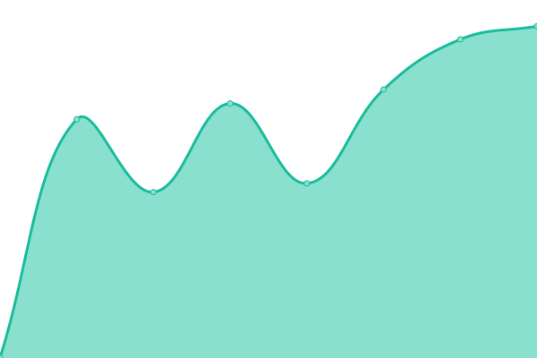

# [📈 Live Status](https://demo.upptime.js.org): <!--live status--> **🟥 Complete outage**

This repository contains the open-source uptime monitor and status page for [Double Click ERP](https://www.doubleclick.com.eg/), powered by [Upptime](https://github.com/upptime/upptime).

With [Upptime](https://upptime.js.org), you can get your own unlimited and free uptime monitor and status page, powered entirely by a GitHub repository. We use [Issues](https://github.com/Double-Click-ERP/dccs/issues) as incident reports, [Actions](https://github.com/Double-Click-ERP/dccs/actions) as uptime monitors, and [Pages](https://demo.upptime.js.org) for the status page.

<!--start: status pages-->
<!-- This summary is generated by Upptime (https://github.com/upptime/upptime) -->
<!-- Do not edit this manually, your changes will be overwritten -->
<!-- prettier-ignore -->
| URL | Status | History | Response Time | Uptime |
| --- | ------ | ------- | ------------- | ------ |
|  [Cloud 1](https://dc-cloud1.de.doubleclick-erp.com/Cloud/) | 🟥 Down | [cloud-1.yml](https://github.com/Double-Click-ERP/dccs/commits/HEAD/history/cloud-1.yml) | 

 0ms
     
 | 

<a href="https://Double-Click-ERP.github.io/dccs/history/cloud-1">3.04%</a>
    

|  [Cloud 3](https://dc-cloud1.de.doubleclick-erp.com/Cloud/) | 🟥 Down | [cloud-3.yml](https://github.com/Double-Click-ERP/dccs/commits/HEAD/history/cloud-3.yml) | 

 0ms
     
 | 

<a href="https://Double-Click-ERP.github.io/dccs/history/cloud-3">0.00%</a>
    

|  [Cloud 4](https://dc-cloud1.de.doubleclick-erp.com/Cloud/) | 🟥 Down | [cloud-4.yml](https://github.com/Double-Click-ERP/dccs/commits/HEAD/history/cloud-4.yml) | 

 0ms
     
 | 

<a href="https://Double-Click-ERP.github.io/dccs/history/cloud-4">1.33%</a>
    

|  [Cloud 5](https://dc-cloud1.de.doubleclick-erp.com/Cloud/) | 🟥 Down | [cloud-5.yml](https://github.com/Double-Click-ERP/dccs/commits/HEAD/history/cloud-5.yml) | 

 0ms
     
 | 

<a href="https://Double-Click-ERP.github.io/dccs/history/cloud-5">0.00%</a>
    

|  [Cloud 6](https://dc-cloud1.de.doubleclick-erp.com/Cloud/) | 🟥 Down | [cloud-6.yml](https://github.com/Double-Click-ERP/dccs/commits/HEAD/history/cloud-6.yml) | 

 0ms
     
 | 

<a href="https://Double-Click-ERP.github.io/dccs/history/cloud-6">0.00%</a>
    

<!--end: status pages-->

[**Visit our status website →**](https://demo.upptime.js.org)

## 📄 License

- Powered by: [Upptime](https://github.com/upptime/upptime)
- Code: [MIT](./LICENSE) © [Anand Chowdhary](https://anandchowdhary.com), supported by [Pabio](https://pabio.com)
- Data in the `./history` directory: [Open Database License](https://opendatacommons.org/licenses/odbl/1-0/)
